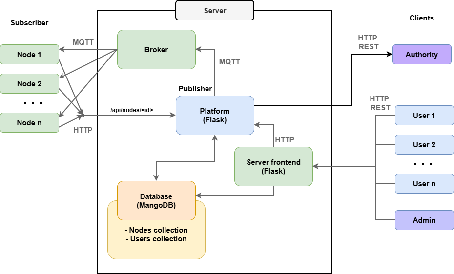

# IoT parking management project

This project aims to create a *prototype* of an automatic **parking control system** dedicated to people with disabilities.

Each parking spot is equipped with an IoT node, that detects car presence and reads user's authentication card.
The user can reserve a parking spot up to one hour in advance, via a secure web interface.
There is a backend, called *platform*, that links nodes and user interface and implement the core logic.

This project was realised in the frame of an IoT course.

## Architecture
### Project architecture


### Code structure
```
IoT_parking_management/
├── analysis_document/   Documentation of the analysis and design phases
├── frontend/            Frontend code
├── platform/            Backend (IoT platform) code
├── node/                Hardware code (parking nodes)
│
├── docker-compose.yaml
├── .env.example         Environment variables + secrets example file
└── README.md
```

## APIs
### Authentication and Access level
All endpoints have a secure access: only logged user with the corresponding rights / node with its secret token will be able to successfully interact with the resource.

There are four distinct entities in terms of authentication:
- external: someone not logged in;
- user: an end-user, logged in via the UI;
- admin: an administrator, logged in via the UI;
- node: a Thing, i.e the parking spot and its associated node.

For users and admins, the authentication is implemented using JWT tokens, stored in cookies (by the frontend). The tokens are sent to the platform in the `Authentication` header.

For nodes, the authentication is based on a secret hardcoded token, that is present on the node and on the database.

### Platform
This it the description of the API of the Platform (cf folder [`platform/`](platform/)).

Endpoints:

| Endpoint               | Allowed methods                  | Description         |
| ---------------------- | -------------------------------- | ------------------- |
| `/api/nodes`           | `GET`, `POST`                    | List of all nodes   |
| `/api/nodes/<node_id>` | `GET`, `POST`, `PATCH`, `DELETE` | A specific node     |
|                        |                                  |                     |
| `/api/users`           | `GET`, `POST`                    | List of all users   |
| `/api/users/<user_id>` | `GET`, `PATCH`, `DELETE`         | A specific user     |
| `/api/users/pwd_reset` | `GET`                            | Send pwd reset link |

Detailed description:

| Method   | Endpoint               | Authorized entity | Description |
| -------- | ---------------------- | ----------------- | ----------- |
| `GET`    | `/api/nodes`           | user, admin       | get list of all nodes   |
| `POST`   | `/api/nodes`           | admin             | create a new node       |
|          |                        |                   |                         |
| `GET`    | `/api/nodes/<node_id>` | user, admin       | get node details (id, pos, status) |
| `POST`   | `/api/nodes/<node_id>` | node              | node scanned a badge and asks platform if authorized |
| `PATCH`  | `/api/nodes/<node_id>` | user, admin, node | update node status (1)  |
| `DELETE` | `/api/nodes/<node_id>` | admin             | delete the node         |
|          |                        |                   |                         |
| `GET`    | `/api/users`           | admin             | get user list           |
| `POST`   | `/api/users`           | admin             | create a new user       |
|          |                        |                   |                         |
| `GET`    | `/api/users/<user_id>` | admin             | get user details        |
| `PATCH`  | `/api/users/<user_id>` | admin             | edit user details       |
| `DELETE` | `/api/users/<user_id>` | admin             | delete user             |
|          |                        |                   |                         |
| `GET`    | `/api/users/pwd_reset` | user, admin       | Send pwd reset link (2) |

(1): There is more control implemented here. The admin can edit any field, the node can only change the status field, and the user can only change status to `reserved`. This is how the platform receives the user's reservation request.

(2): The user's token is used to determine the ID.

### Frontend
This it the description of the API of the Platform (cf folder [`frontend/`](frontend/)).

Endpoints:

| Endpoint            | Allowed methods | Authorized            | Description      |
| ------------------- | --------------- | --------------------- | ---------------- |
| `/`                 | `GET`           | external, user, admin | home page (1)    |
| `/login`            | `GET`, `POST`   | external, user, admin | login page       |
| `/logout`           | `GET`           | external, user, admin | logout (2)       |
| `/reservation_page` | `GET`           | user, admin           | reservation page |
| `/nodes_page`       | `GET`           | admin                 | nodes management |
| `/users_page`       | `GET`           | admin                 | users management |

(1): redirects to `/login` if not logged in (external).
(2): redirects to `/login`.

## Setup and run
### Env
Create `.env`:
```
cp .env.example .env
```

Then edit it (set empty variables).

### Mosquitto
Run:
```
cd data/
sudo ./create_mosquitto.sh
```

Create certs (run only this for development, use let's encrypt for production):
```
sudo ./create_self_signed_certs.sh
```

Create the users `serv` and `node`:
```
docker exec -it project-mosquitto mosquitto_passwd -c /mosquitto/config/passwd serv
docker exec -it project-mosquitto mosquitto_passwd /mosquitto/config/passwd node
```

### Run (production)
```
docker compose up -d
```

### Run (development)
- DB and broker in docker:
```
docker compose up iot-mongodb iot-mosquitto -d
```

- Platform:
```
cd platform/
source .venv/bin/activate
python app.py
```

- Frontend (in an other terminal):
```
cd frontend/
source .venv/bin/activate
python app.py
```

Then go to [`localhost:3000`](http://localhost:3000/)

You can also test the APIs using the scripts in [`frontend/api_tests`](frontend/api_tests) and [`platform/api_tests`](platform/api_tests).
